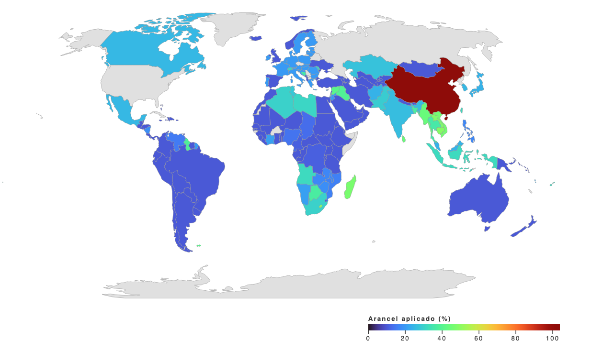
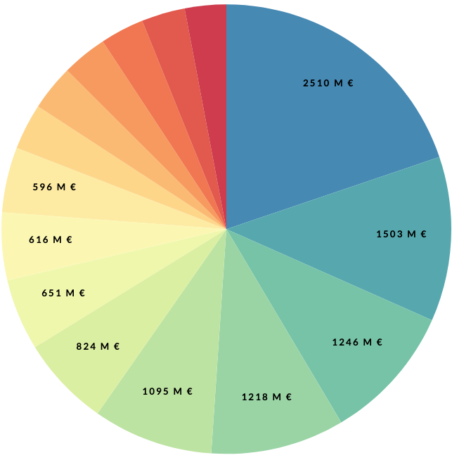

<p align="center"></p>
<p align="center" style="font-family: 'Calibri Light'; font-size:30px">Universidad Internacional de La Rioja</p>
<p align="center" style="font-family: 'Calibri Light'; font-size:26px">Escuela Superior de Ingeniería y Tecnología</center></p>


<p align="center" style="font-family: 'Calibri Light'; font-size:24px"><strong>Master en Inteligencia Artificial</strong></p>
<p align="center" style="font-family: 'Calibri Light'; font-size:24px">Herramientas de visualización</p>

<p align="center"><strong style="font-family: 'Calibri'; font-size:30px; color:#0098CD">Análisis de tendencias en D3.js</strong></p>


<div align="center">
  	<a href="https://github.com/JMPinillos/Data-Analyst-para-Inteligencia-Artificial" target="_blank"></a>
  	<a href="https://jmpinillos.github.io/Data-Analyst-para-Inteligencia-Artificial/" target="_blank"></a>
</div>


<p align="center" style="font-family: 'Calibri Light'; font-size:18px">
  Jose Manuel Pinillos Rubio
</p>


<h2>ÍNDICE</h2>

[TOC]

<h2>ÍNDICE DE FIGURAS</h2>

[Figura 1. Estructura del proyecto web](#Figura_1)

[Figura 2. Leyenda del mapa](#Figura_2)

[Figura 3. Tooltip del mapa desplegado](#Figura_3)

[Figura 4. Mapa interactivo](#Figura_4)

[Figura 5. Gráfico de barras](#Figura_5)

[Figura 6. Tooltip del gráfico de barras desplegado](#Figura_6)

[Figura 7. Gráfico de tarta](#Figura_7)

[Figura 8. Tooltip del gráfico de tarta](#Figura_8)

[Figura 9. Leyenda del gráfico de tarta](#Figura_9)


## 1. INTRODUCCIÓN

En 2025, la política económica internacional vivió una etapa de gran tensión debido a las decisiones arancelarias adoptadas por el presidente de Estados Unidos, Donald Trump. La proclamación del "Día de la Liberación Económica" marcó el inicio de una guerra arancelaria sin precedentes, en la que Estados Unidos impuso un arancel universal del 10 % a todas las importaciones, aplicando tarifas adicionales de hasta el 20 % a la Unión Europea y elevando los aranceles a China hasta alcanzar el 104 %. Esta estrategia de presión económica provocó una serie de medidas de represalia, especialmente por parte de China y la Unión Europea, intensificando el proteccionismo y desestabilizando los flujos comerciales a nivel mundial.

El impacto económico de estas decisiones no tardó en manifestarse. A nivel global, se produjeron aumentos de precios, reconfiguración de cadenas de suministro y tensiones en sectores estratégicos como el automotriz, el tecnológico o el agrícola. En el contexto europeo, la imposición de aranceles afectó de forma directa a las exportaciones de bienes, debilitando las relaciones comerciales entre la UE y uno de sus principales socios estratégicos. España, como miembro de la Unión Europea, también sufrió consecuencias, especialmente en sectores clave como el agroalimentario y el industrial, donde las exportaciones a Estados Unidos representan un volumen significativo del comercio exterior.

En esta actividad, se ha desarrollado una página web interactiva que permite analizar gráficamente los efectos de estas medidas proteccionistas a través de diversas representaciones dinámicas construidas con la librería D3.js.

Todas las visualizaciones empleadas en esta actividad han sido diseñadas de manera interactiva, integrando tooltips y elementos de interactividad que enriquecen la experiencia de exploración de los datos, mostrando detalles adicionales al pasar el cursor sobre los elementos gráficos. El uso de D3.js ha permitido desarrollar representaciones altamente personalizadas y adaptadas a los objetivos de análisis planteados.

De este modo, la actividad ofrece un análisis visual integral de las tensiones comerciales actuales mediante tres representaciones principales: un mapa mundial interactivo de aranceles basado en una escala de color de azul a rojo según la intensidad de los gravámenes aplicados, un gráfico de barras que muestra el volumen de exportaciones de la Unión Europea a distintos países, y un diagrama de tarta que recoge las principales exportaciones de España a Estados Unidos.


## 2. OBJETIVOS

Desarrollar una página web interactiva aplicando los conocimientos adquiridos sobre visualización de datos mediante la librería D3.js, integrando múltiples fuentes externas de información comercial. Se busca construir representaciones visuales dinámicas, claras y comparativas que faciliten el análisis del impacto de las políticas arancelarias en el comercio internacional.

El proyecto comprende la correcta planificación y estructuración modular de la arquitectura web, la implementación de buenas prácticas en el diseño de interfaces, el uso de estilos CSS personalizados para garantizar coherencia visual y la incorporación de interactividad avanzada mediante tooltips y elementos dinámicos.

Finalmente, se pretende presentar los resultados a través de una plataforma profesionalmente organizada, orientada a la comprensión crítica de los fenómenos representados y apoyada en el rigor técnico y estético de la visualización de datos.

 

## 3. DATOS

Los datos utilizados en este proyecto recopilan información sobre los aranceles aplicados por Estados Unidos al resto de países, así como sobre los flujos comerciales entre la Unión Europea, España y Estados Unidos.

Para la construcción del **mapa mundial interactivo** y del **gráfico de barras**, se han empleado datos extraídos del portal [epdata](https://www.epdata.es/), concretamente del conjunto titulado [*"Comercio entre la Unión Europea, España y Estados Unidos: importaciones, exportaciones y balanza comercial en gráficos"*](https://www.epdata.es/datos/importaciones-espanolas-estados-unidos-datos-graficos/456). Estos datos proporcionan una visión detallada de los aranceles por país y del volumen de exportaciones, permitiendo representar de forma visual tanto la magnitud como la distribución de los flujos comerciales y de las medidas arancelarias.

En el caso del **gráfico de tarta**, se han utilizado datos específicos sobre las exportaciones españolas hacia Estados Unidos, obtenidos del informe [*"Las principales exportaciones de España a Estados Unidos"*](https://elordenmundial.com/mapas-y-graficos/exportaciones-espana-estados-unidos/), publicado por [El Orden Mundial (EOM)](https://elordenmundial.com/). Estos datos permiten analizar con mayor detalle los principales productos y sectores involucrados en la relación comercial bilateral entre ambos países.

Finalmente, se proporcionarán enlaces de descarga directa a los conjuntos de datos utilizados, de manera que el usuario pueda acceder a las fuentes originales para su consulta o análisis posterior.

- [aranceles_adaptados_d3.csv](https://github.com/JMPinillos/Data-Analyst-para-Inteligencia-Artificial/blob/main/assets/data/aranceles_adaptados_d3.csv)
- [exportaciones_espana_eeuu.csv](https://github.com/JMPinillos/Data-Analyst-para-Inteligencia-Artificial/blob/main/assets/data/exportaciones_espana_eeuu.csv)
- [volumen_de_las_exportaciones_de_la_ue_a_otros_paises.csv](https://github.com/JMPinillos/Data-Analyst-para-Inteligencia-Artificial/blob/main/assets/data/volumen_de_las_exportaciones_de_la_ue_a_otros_paises.csv)

 

## 4. DESARROLLO E IMPLEMENTACIÓN

Este apartado describe en detalle el proceso de construcción de la página web desarrollada, abordando tanto su diseño arquitectónico como los aspectos técnicos de implementación. Se analiza la organización de los recursos, la estructura general del documento HTML, la integración de las visualizaciones interactivas mediante D3.js (incluyendo el mapa mundial de aranceles, el gráfico de barras de exportaciones y el gráfico circular de exportaciones españolas), así como el diseño y personalización de los estilos CSS aplicados.

La sección también incorpora explicaciones específicas sobre la generación de leyendas dinámicas, la gestión de la interactividad mediante tooltips, y la correcta estructuración de la navegación y el pie de página, todo ello orientado a lograr una presentación visual coherente, funcional y profesional.

 

### 4.1 Diseño de la arquitectura

El diseño de la arquitectura de la web desarrollada para esta actividad responde a criterios de organización lógica, escalabilidad y claridad estructural. Para garantizar una buena mantenibilidad del proyecto y facilitar futuras ampliaciones, se ha optado por una distribución modular de los recursos en carpetas temáticas.

La raíz del proyecto contiene el archivo principal `index.html`, que actúa como punto de entrada de la aplicación. Desde este archivo se cargan, de forma ordenada y diferida, los distintos módulos JavaScript encargados de generar las visualizaciones, así como los recursos de estilos y datos.

Todo el contenido se ha agrupado en una carpeta `assets`, que actúa como contenedor principal de los recursos estáticos. Esta carpeta, a su vez, se subdivide en varias subcarpetas especializadas:

- **`assets/css`**: contiene las hojas de estilo utilizadas en el proyecto. Se incluye aquí tanto la hoja style.css con las reglas personalizadas como otras posibles hojas externas como fuentes o plantillas de Bootstrap si fueran necesarias.
- **`assets/js`**: alberga los scripts JavaScript divididos por funcionalidad. Esta división permite una separación clara de responsabilidades:
  - **`mapa.js`** se encarga de generar y configurar el mapa de aranceles mundiales.
  - **`barras.js`** contiene la lógica para construir el diagrama de barras de exportaciones de la UE.
  - **`tarta.js`** genera el gráfico circular de exportaciones de España a Estados Unidos.
  - **`legend.js`** define una función reutilizable para construir una leyenda continua a partir de una escala de color.
- **`assets/data`**: se encuentran los ficheros CSV que alimentan las visualizaciones. La separación de los datos respecto al código permite modificar fácilmente los valores sin tocar el código de representación.
- **`assets/images`**: incluye las imágenes del proyecto, como el logotipo institucional o cualquier recurso visual adicional.

 

<p align="center"></p>

<p align="center"><i>Figura 1. Estructura del proyecto web</i></p>


Esta estructura modular evita la redundancia y mejora la claridad, ya que cada componente está claramente delimitado. Asimismo, garantiza que los elementos compartidos (como funciones auxiliares o estilos comunes) puedan reutilizarse fácilmente sin generar dependencias innecesarias entre los distintos gráficos.

Además, este diseño facilita el trabajo colaborativo en entornos donde múltiples personas pueden editar partes distintas del proyecto. Por ejemplo, un desarrollador puede trabajar sobre los estilos sin afectar el código de visualización, o los datos pueden actualizarse de forma autónoma desde la carpeta `data`.

Por último, esta organización responde a prácticas estándar de desarrollo web, siendo fácilmente integrable en entornos más complejos como servidores estáticos, *frameworks front-end* o sistemas de control de versiones. En resumen, se trata de una estructura sencilla pero robusta, pensada para crecer sin comprometer la legibilidad ni la eficiencia del mantenimiento.

 

### 4.2 Index.htlm

El archivo `index.html` constituye el núcleo de la estructura visible de la página web y actúa como punto de entrada para las diferentes visualizaciones desarrolladas mediante D3.js. Su diseño responde a un enfoque modular, claro y escalable, que permite integrar contenido textual, elementos interactivos y gráficos SVG sin comprometer la organización o el mantenimiento del proyecto.

El documento está construido respetando los estándares de HTML5 y presenta una estructura organizada que incluye referencias externas a hojas de estilo CSS, bibliotecas de JavaScript y los módulos desarrollados para cada visualización. También incluye metaetiquetas informativas para optimizar la accesibilidad, la indexación y el rendimiento en navegadores modernos.

 

#### 4.2.1 Estructura del documento

La estructura se compone de dos grandes bloques: `<head>` y `<body>`. En el bloque <head> se definen los metadatos, se vinculan los recursos externos y se cargan las librerías necesarias. En el `<body>` se organiza el contenido visible, distribuido en secciones semánticas que alojan las distintas visualizaciones y los textos explicativos correspondientes.

El encabezado incluye las etiquetas `<meta>` necesarias para definir el conjunto de caracteres, el diseño responsive y los metadatos de autor y descripción del proyecto:

```html
<meta charset="UTF-8">
<meta name="viewport" content="width=device-width, initial-scale=1.0">
<meta name="author" content="JMPinillos">
<meta name="description" content="Aranceles aplicados por EE.UU.">
<meta name="keywords" content="Aranceles, comercio, Estados Unidos, Unión Europea, China, exportaciones">
```

 

Además, se especifica el título del documento y se enlazan los estilos CSS:

```html
<title>Aranceles EEUU VS World</title>
<link rel="stylesheet" href="assets/css/bootstrap.css">
<link rel="stylesheet" href="assets/css/font.css">
<link rel="stylesheet" href="assets/css/style.css">
```

 

También se importa la librería D3.js desde su CDN oficial y se integran los *scripts* desarrollados para cada componente visual, definidos con el atributo `defer` para garantizar su carga asincrónica:

```html
<script src ="https://d3js.org/d3.v6.min.js"></script>
<script src ="assets/js/modules/legend.js" defer></script>
<script src="assets/js/modules/mapa.js" defer></script>
<script src="assets/js/modules/barras.js" defer></script>
<script src="assets/js/modules/tarta.js" defer></script>
```


El cuerpo del documento está dividido en varias secciones diferenciadas, cada una de ellas con una estructura clara, contenido textual explicativo y un área destinada a contener una visualización interactiva generada mediante D3.js. Estas secciones están organizadas verticalmente dentro del archivo y son accesibles mediante navegación interna.


##### 4.2.1.1 Menú de navegación

La navegación principal está situada en la parte superior de la página y se presenta como una barra horizontal fija. Dentro de ella, se incluye una lista de elementos de navegación (`<ul>` con elementos `<li>`) que contienen enlaces internos (`<a>`) a las distintas secciones del sitio. Cada uno de estos enlaces permite al usuario desplazarse directamente a un bloque temático específico de la página: introducción, mapa, gráfico de barras o gráfico circular. Esta estructura favorece una experiencia de usuario fluida y organizada, especialmente útil en un entorno de una sola página (*single-page application*).

```html
<ul class="nav nav-list navbar-nav navbar-right">
    <li><a class="nav-item" href="#inicio">Inicio</a></li>
    <li><a class="nav-item" href="#map">Impacto</a></li>
		<li><a class="nav-item" href="#exportacionesUE">Comercio</a></li>
		<li><a class="nav-item" href="#exportacionesEspana">España</a></li>
</ul>
```

 

##### 4.2.1.2 Secciones de contenido

Cada una de las secciones principales de la página está construida utilizando la estructura estándar de *Bootstrap*, basada en contenedores (`<div class="container">`), filas (`<div class="row">`) y columnas (`<div class="col-md-12">`, `<div class="col-md-6">`, etc.). Esta arquitectura permite una maquetación flexible y responsiva que se adapta correctamente a distintos tamaños de pantalla.

Las secciones están identificadas mediante id únicos, lo que facilita el anclaje interno desde el menú de navegación superior. Cada sección tiene además una clase específica como `inicio-section`, `map-section`, `exportacionesUE-section` o `exportacionesEspana-section`, que permite aplicar estilos visuales diferenciados.

 

##### 4.2.1.3 Sección de introducción ("Inicio")

La sección de inicio está diseñada para ofrecer un encabezado llamativo, con un título destacado y un párrafo introductorio. El contenido está centrado en una única columna que abarca todo el ancho de la fila, lo que facilita la lectura. Esta sección sirve como punto de entrada informativo antes de las visualizaciones interactivas.


##### 4.2.1.4 Sección del mapa ("Mapa de aranceles")

Esta sección contiene dos partes principales:

- Un bloque de texto explicativo con varios párrafos, donde se contextualiza el conflicto comercial, se citan fuentes periodísticas relevantes y se justifica la importancia del mapa.
- Un contenedor gráfico en el que se renderiza el mapa interactivo mediante D3.js. El mapa está insertado dentro de un `div` con el identificador mapa, y junto a él se sitúa un `tooltip` que aparece dinámicamente cuando el usuario interactúa con el gráfico.

 

##### 4.2.1.5 Sección del gráfico de barras ("Exportaciones UE a otros países")

Esta sección mantiene la misma estructura que la anterior:

- Una columna de texto en la que se describen los datos comerciales entre la Unión Europea y sus principales socios. Se incorporan cifras clave, evolución anual, y se cita la fuente oficial.
- Un bloque gráfico en el que se genera, dentro de un `div` específico, un gráfico de barras utilizando D3.js. También se incluye un `tooltip` que muestra información detallada al pasar el cursor sobre cada barra.

 

##### 4.2.1.6 Sección del gráfico circular ("Exportaciones de España a EE.UU.")

Aquí se utiliza una disposición en dos columnas:

- En la parte izquierda se presenta el texto explicativo con datos concretos sobre los principales productos exportados por España a Estados Unidos. La estructura y el estilo siguen la línea de las secciones anteriores.
- En la parte derecha se sitúa el gráfico circular, representado en un `div` exclusivo (`graficoCircular`). Esta visualización también se acompaña de un `tooltip`, y se ha añadido una leyenda SVG para facilitar la interpretación del gráfico.

 

##### 4.2.1.7 Pie de página (*Footer*)

El documento finaliza con una sección de pie de página estructurada también con *Bootstrap*, utilizando una disposición en dos columnas dentro de un contenedor. Esta sección, delimitada mediante la clase `footer-section`, cumple una función informativa y estética, cerrando visualmente la página con coherencia y limpieza.

- La primera columna (`col-md-4 col-sm-5`) contiene un mensaje de derechos reservados que comunica la autoría y protección del contenido.La segunda columna (`col-md-8 col-sm-5 text-right`) incluye una lista horizontal de enlaces a posibles recursos adicionales como políticas, licencia o espacio de discusión. Aunque estos enlaces son actualmente estáticos, están estructurados para que puedan activarse o personalizarse en futuras versiones del proyecto.
- La segunda columna (`col-md-8 col-sm-5 text-right`) incluye una lista horizontal de enlaces a posibles recursos adicionales como políticas, licencia o espacio de discusión. Aunque estos enlaces son actualmente estáticos, están estructurados para que puedan activarse o personalizarse en futuras versiones del proyecto.

Además, se utilizan clases como `mobile-center` para garantizar una buena visualización en dispositivos móviles, asegurando que tanto el texto como los enlaces se centren o distribuyan adecuadamente según el ancho de pantalla. La disposición general es clara, funcional y profesional, acorde con el estilo general de la página.

 

### 4.3 Mapa mundial con D3

Esta sección describe el funcionamiento y estructura del *script* `mapa.js`, responsable de generar el mapa interactivo donde se visualizan los aranceles aplicados por Estados Unidos a distintos países.

Se ha incluido un mapa interactivo que muestra el nivel de arancel aplicado, codificado mediante una escala de color continua. El usuario puede interactuar con el gráfico desplazando el cursor sobre cada país para consultar el valor porcentual de los aranceles. Esta interacción mejora la comprensión del impacto de las políticas comerciales y permite analizar de forma comparativa las decisiones adoptadas por Estados Unidos respecto a sus socios comerciales.

 

#### 4.3.1 Carga y configuración inicial del SVG

El mapa se dibuja dentro de un elemento SVG que se inserta en el `div` con id `"mapa"`. Para ello, se definen previamente las dimensiones del contenedor y se aplica una proyección geográfica adecuada (`geoNaturalEarth1`) para representar el mundo de forma proporcionada.

```javascript
const widthMapa = 960;
const heightMapa = 600;

const svg = d3.select("#mapa")
    .append("svg")
    .attr("width", widthMapa)
    .attr("height", heightMapa);

const projection = d3.geoNaturalEarth1()
    .scale(160)
    .translate([widthMapa / 2, heightMapa / 2]);

const path = d3.geoPath().projection(projection);
```

La función `d3.geoNaturalEarth1()` genera una proyección compatible con mapas de escala mundial, centrada y escalada a partir de las dimensiones definidas.

 

#### 4.3.2 Carga de los datos de aranceles

Los datos se obtienen desde un archivo CSV llamado `aranceles_adaptados_d3.csv`, donde se recoge la información del porcentaje de arancel aplicado por Estados Unidos a cada país. Esta información se guarda en una estructura de tipo `Map`, utilizando el nombre del país como clave.

```javascript
let aranceles = new Map();

d3.dsv(";", "assets/data/aranceles_adaptados_d3.csv").then(data => {

    data.forEach(d => aranceles.set(d["Parámetro"], +d["Aranceles"]));
    const valores = data.map(d => +d["Aranceles"]);
```


Una vez cargados los datos, se calcula el valor mínimo y máximo de los aranceles, para generar una escala de color continua (`d3.scaleSequential`) que se utilizará para colorear los países según su valor.

```javascript
    const minArancel = d3.min(valores);
    const maxArancel = d3.max(valores);

    const colorScale = d3.scaleSequential()
        .domain([minArancel, maxArancel])
        .interpolator(d3.interpolateTurbo)
        .clamp(true);
```


#### 4.3.3 Leyenda del mapa

Para interpretar los colores del mapa, se incorpora una leyenda generada mediante la función reutilizable `Legend`, que será explicada en el apartado **4.4**. Esta leyenda se posiciona en la esquina inferior derecha del SVG y adapta dinámicamente su escala al rango de valores del conjunto de datos.


```javascript
    const legend = Legend(colorScale, {
        title: "Arancel aplicado (%)",
        width: 300
    });

    svg.append(() => legend)
        .attr("transform", `translate(${widthMapa - 340}, ${heightMapa - 50})`);
```

 

<p align="center"></p>

<p align="center"><i>Figura 2. Leyenda del mapa</i></p>

 

#### 4.3.4 Representación del mapa

El mapa mundial se construye a partir de un fichero `GeoJSON` remoto, que contiene las fronteras geográficas de los países. Cada país se representa como una ruta (`<path>`), a la cual se le asigna un color en función de su valor de arancel.

```javascript
    d3.json("https://raw.githubusercontent.com/holtzy/D3-graph-gallery/master/DATA/world.geojson")
        .then(world => {

            const tooltip = d3.select("#tooltip_mapa");

            svg.append("g")
                .selectAll("path")
                .data(world.features)
                .enter()
                .append("path")
                .attr("d", path)
                .attr("class", "country")
                .attr("fill", d => {
                    const nombre = d.properties.name;
                    const valor = aranceles.get(nombre);
                    return valor != null ? colorScale(valor) : "#e0e0e0";
                })
```

Cada país recibe el color correspondiente a su valor de arancel, y los que no tienen datos se muestran en gris claro (`#e0e0e0`).


#### 4.3.5 Interactividad con tooltip

Se ha añadido un sistema de interacción que permite mostrar un *tooltip* con el nombre del país y su arancel correspondiente cuando el usuario pasa el cursor por encima. El *tooltip* se desplaza dinámicamente con el cursor.

```javascript
                .on("mouseover", function (event, d) {
                    const nombre = d.properties.name;
                    const valor = aranceles.get(nombre);

                    d3.select(this).classed("highlight", true);

                    tooltip
                        .style("opacity", 1)
                        .html(`<strong>${nombre}</strong><br>${valor != null ? valor + "%" : "Sin datos"}`);
                })
                .on("mousemove", function (event) {
                    tooltip
                        .style("left", `${event.pageX + 10}px`)
                        .style("top", `${event.pageY - 28}px`);
                })
                .on("mouseout", function () {
                    d3.select(this).classed("highlight", false);
                    tooltip.style("opacity", 0);
                });
```


<p align="center"></p>

<p align="center"><i>Figura 3. Tooltip del mapa desplegado</i></p>


Este sistema mejora la experiencia del usuario al permitir la exploración individual de cada país con detalle y sin sobrecargar el mapa con etiquetas visibles.

La siguiente imagen muestra una vista general del mapa interactivo, donde se representan los aranceles aplicados por Estados Unidos mediante una escala cromática continua.


<p align="center"></p>

<p align="center"><i>Figura 4. Mapa interactivo</i></p>

 

#### 4.3.6 Legend.js

Para complementar las visualizaciones de datos, se ha desarrollado un módulo independiente llamado `Legend.js`, que contiene una función reutilizable encargada de generar de forma automática una leyenda continua basada en escalas de color interpoladas.

El propósito de esta función es ofrecer al usuario una referencia visual clara que permita interpretar el significado de los colores aplicados en gráficos como el mapa de aranceles. De este modo, se facilita la comprensión de los rangos numéricos asociados a cada color representado en las visualizaciones.

Desde el punto de vista técnico, la función `Legend` recibe como parámetros una escala de color y una serie de opciones de personalización, como el título, el tamaño de los ticks del eje, el ancho y alto de la leyenda, o los márgenes internos.

El procedimiento que sigue la función puede resumirse de la siguiente manera:

- Primero, se crea un contenedor SVG configurado con las dimensiones especificadas.
- Si la escala de color es continua (dispone de interpolador), se genera una imagen que simula el degradado de color a través de un elemento `<canvas>`, mediante la función auxiliar `ramp`. Esta imagen se incorpora al SVG como un `<image>`.
- Posteriormente, se añade un eje horizontal (*axis bottom*) en la parte inferior de la leyenda, indicando valores numéricos de referencia. Sobre el eje también se inserta el título de la leyenda.
- Finalmente, el SVG construido se devuelve para que pueda ser incrustado en el contenedor principal donde se necesite (por ejemplo, en el mapa de aranceles).

Este diseño modular no solo permite reutilizar la leyenda en diferentes gráficos, sino que también garantiza su adaptación automática a cualquier rango de valores que pueda tener la escala de color.

En el siguiente fragmento puede verse un ejemplo simplificado de cómo se utiliza esta función en el archivo `mapa.js`:

```javascript
    const legend = Legend(colorScale, {
        title: "Arancel aplicado (%)",
        width: 300
    });

    svg.append(() => legend)
        .attr("transform", `translate(${widthMapa - 340}, ${heightMapa - 50})`);

```

 

Gracias a este enfoque, el mantenimiento y la flexibilidad del proyecto aumentan, ya que cualquier modificación en el aspecto de la leyenda puede hacerse directamente en `Legend.js` sin necesidad de alterar el resto de la lógica de visualización.

 

### 4.4 Gráfico de barras con D3

Para representar el volumen de exportaciones de bienes de la Unión Europea hacia diferentes países, se ha desarrollado un gráfico de barras. Esta visualización permite una comparación clara y eficaz entre los distintos socios comerciales, destacando visualmente la importancia de cada uno en términos de volumen exportado.

La construcción del gráfico comienza con la creación de un contenedor SVG dentro del `div` identificado como `#barras_exportaciones`. Este SVG tiene unas dimensiones de **960 píxeles de ancho** y **600 píxeles de alto**, definiendo así un espacio adecuado para mostrar un número elevado de categorías sin comprometer la legibilidad.

Dentro del SVG, se define un grupo `<g>` principal, desplazado mediante márgenes internos, que sirve como lienzo de trabajo para dibujar los ejes, las barras y demás elementos interactivos.

Los datos utilizados se cargan desde el archivo CSV: `volumen_de_las_exportaciones_de_la_ue_a_otros_paises.csv`. Durante la carga de datos, se realiza un preprocesamiento en el que los valores monetarios se transforman correctamente en números flotantes, reemplazando la coma decimal por el punto estándar de JavaScript.

Para representar los datos, se emplean tres escalas:

- **Escala horizontal (x)** de tipo `band`, que organiza los nombres de los países en el eje inferior y define el ancho de cada barra con separación (`padding`) entre ellas.
- **Escala vertical (y)** de tipo `linear`, que sitúa la altura de cada barra en proporción directa al volumen de exportaciones.
- **Escala de color secuencial**, que asigna a cada barra un color progresivo desde azul a rojo según su valor, usando el interpolador `d3.interpolateRgb`.

Los ejes se generan utilizando las funciones `d3.axisBottom` (para el eje X) y `d3.axisLeft` (para el eje Y). Además, las etiquetas del eje X se rotan **45 grados** para evitar la superposición de nombres largos de países, mejorando así la legibilidad general.

Cada barra del gráfico representa un país exportador, y está vinculada a un evento `mouseover` que activa un **tooltip dinámico**. Este `tooltip` muestra el nombre del país y el valor total de exportación en millones de euros de forma detallada. Además, al pasar el cursor sobre una barra, se resalta visualmente mediante la aplicación de un contorno negro.

El siguiente fragmento de código muestra la estructura utilizada para construir las barras:

```javascript
  gExport.selectAll(".bar")
    .data(data)
    .enter()
    .append("rect")
    .attr("class", "bar")
    .attr("x", d => x(d["Parámetro"]))
    .attr("y", d => y(d["€"]))
    .attr("width", x.bandwidth())
    .attr("height", d => heightExport - y(d["€"]))
    .attr("fill", d => colorExport(d["€"]))

    .on("mouseover", function (event, d) {
      d3.select(this)
        .attr("stroke", "#000")
        .attr("stroke-width", 1.5);

      const nombre = d.Parámetro;
      const valor = d["€"] * 1000;

      tooltip
        .style("opacity", 1)
        .html(`<strong>${nombre}</strong><br>${valor.toLocaleString("es-ES")} millones €`);
    })

    .on("mousemove", function (event) {
      tooltip
        .style("left", (event.pageX + 10) + "px")
        .style("top", (event.pageY - 28) + "px");
    })

    .on("mouseout", function () {
      d3.select(this).attr("stroke", null);
      tooltip.style("opacity", 0);
    });
```

 

Este sistema de interacción mejora la experiencia del usuario, permitiéndole consultar valores exactos sin saturar el gráfico con etiquetas fijas, y facilita una exploración detallada de los principales destinos de las exportaciones de la Unión Europea.


<p align="center"></p>

<p align="center"><i>Figura 5. Gráfico de barras</i></p>


Al pasar el ratón sobre cualquier barra, se activa un tooltip emergente que proporciona detalles adicionales sobre las exportaciones específicas de cada país.


<p align="center"></p>

<p align="center"><i>Figura 6. Tooltip del gráfico de barras desplegado</i></p>

 

### 4.5 Gráfico de tarta con D3

Para representar los principales productos que España exporta a Estados Unidos, se ha implementado un **gráfico de tarta** o **gráfico de sectores**. Esta visualización proporciona una visión intuitiva de la distribución de las categorías exportadoras, facilitando la comparación del peso relativo de cada tipo de producto en el volumen total.

 

<p align="center"></p>

<p align="center"><i>Figura 7. Gráfico de tarta</i></p>

 

El diagrama se construye dentro de un **SVG** añadido al `div` identificado como `#graficoCircular`. Las dimensiones iniciales del gráfico son de **600 píxeles de ancho** y **500 píxeles de alto**, aunque se añade un espacio extra en altura para permitir la correcta colocación de la leyenda bajo el gráfico.

Una vez cargado el conjunto de datos desde el archivo CSV `exportaciones_espana_eeuu.csv`, se preprocesan los valores para asegurarse de que sean tratados como números. Posteriormente, se define una escala de colores utilizando la interpolación `d3.interpolateSpectral`, que proporciona una gama cromática amplia y contrastada. Esta elección garantiza que cada categoría del gráfico tenga un color diferenciado y visualmente atractivo.

Para construir los sectores del gráfico, se emplean las funciones de D3:

- **d3.pie()**: convierte los datos de exportaciones en ángulos proporcionales que definen cada sector.
- **d3.arc()**: genera las formas de los sectores, desde el centro hasta el borde exterior del círculo.

A continuación, se añaden las etiquetas centradas cerca del borde de cada sector. Las etiquetas solo aparecen para aquellos sectores suficientemente grandes, evitando así saturar la visualización. Para posicionar estos textos se utiliza un **generador de arcos adicional** llamado `arcLabel`.

```javascript
    const arc = d3.arc()
        .innerRadius(0)
        .outerRadius(radius - 10);

    const arcLabel = d3.arc()
        .innerRadius(radius * 0.75)
        .outerRadius(radius * 0.75);

    gArcs.append("path")
        .attr("d", arc)
        .attr("fill", d => colorPie(d.data.Categoría))
        .on("mouseover", function (event, d) {
            d3.select(this).attr("stroke", "#000").attr("stroke-width", 1.5);
            tooltip
                .style("opacity", 1)
                .html(`<strong>${d.data.Categoría}</strong><br>${d.data.Valor.toLocaleString("es-ES")} millones €`);
        })
        .on("mousemove", function (event) {
            tooltip
                .style("left", (event.pageX + 10) + "px")
                .style("top", (event.pageY - 28) + "px");
        })
        .on("mouseout", function () {
            d3.select(this).attr("stroke", null);
            tooltip.style("opacity", 0);
        });
```


Este sistema de interacción mejora notablemente la experiencia del usuario, permitiéndole consultar los datos detallados de cada categoría al pasar el cursor sobre el sector correspondiente.


<p align="center"></p>

<p align="center"><i>Figura 8. Tooltip del gráfico de tarta</i></p>


Además, se ha incorporado una leyenda bajo el gráfico, distribuida en dos columnas, que facilita la identificación rápida de los colores asociados a cada categoría exportadora.


<p align="center"></p>

<p align="center"><i>Figura 9. Leyenda del gráfico de tarta</i></p>

 

### 4.6 CSS

Para lograr un diseño limpio, estructurado y *responsive*, se ha implementado una hoja de estilos personalizada que organiza y da formato a los diferentes apartados de la página web. El archivo style.css gestiona tanto la apariencia general de los textos y contenedores como el aspecto visual de los gráficos D3.

 

#### 4.6.1 Reset CSS

Se aplica un *reset* general sobre elementos HTML básicos (como `body`, `div`, `h1`, `p`, `ul`, etc.) para eliminar márgenes, *paddings* y bordes predeterminados. De esta forma, se asegura una base homogénea en todos los navegadores.

Ejemplo de *reset* aplicado:

```css
html, body, div, span, applet, object, iframe,
h1, h2, h3, h4, h5, h6, p, blockquote, pre, a {
    margin: 0;
    padding: 0;
    border: 0;
    outline: 0;
    vertical-align: baseline;
    background: transparent;
}
```


#### 4.6.2 Estilos comunes y utilidades

Se definen clases genéricas como `.no-padding`, `.no-margin`, `.relative`, o `.button`, que se utilizan en diversas partes de la página para controlar espaciados y botones de acción.

 

#### 4.6.3 Estructura y disposición de la página

Cada sección principal (inicio, mapa, exportaciones UE, exportaciones España) cuenta con su propio espaciado vertical (`padding-top`) para lograr una separación visual clara entre bloques. La clase `.alt-bg` se utiliza para alternar fondos ligeramente coloreados en algunas secciones.

 

#### 4.6.4 Estilización específica de las visualizaciones

Los contenedores de los gráficos D3 (`#mapa`, `#barras_exportaciones`, `#graficoCircular`) comparten un estilo homogéneo basado en flexbox, fondo blanco, bordes suaves y sombreados ligeros.

Ejemplo:

```css
#mapa, #barras_exportaciones, #graficoCircular {
    display: flex;
    justify-content: center;
    align-items: center;
    background-color: #ffffff;
    border: 1px solid #ccc;
    box-shadow: 0 0 10px rgba(0,0,0,0.1);
    padding: 10px;
    width: fit-content;
    height: fit-content;
    margin: 0 auto;
}
```

 

#### 4.6.5 Elementos interactivos D3

Se definen estilos para el mapa mundial interactivo:

- **`.country`** establece el color del borde de los países.
- **`.country:hover`** aumenta el grosor del borde y aplica una sombra al pasar el cursor.

También se define `.highlight` para remarcar visualmente un país o una barra cuando el usuario interactúa:

```css
.country {
    stroke: #999;
    stroke-width: 0.5;
    transition: stroke 0.2s, stroke-width 0.2s, filter 0.2s;
}

.country:hover {
    stroke: #000;
    stroke-width: 1.2;
    filter: drop-shadow(0 0 4px rgba(0, 0, 0, 0.3));
}
```

 

#### 4.6.6 Tooltips personalizados

Se han diseñado tooltips flotantes con aspecto limpio, fondo blanco, bordes redondeados y sombras suaves, adaptados a cada visualización:

```css
.tooltip {
    position: absolute;
    opacity: 0;
    background: white;
    border: 1px solid #ccc;
    padding: 6px 10px;
    border-radius: 4px;
    font-size: 13px;
    pointer-events: none;
    transition: opacity 0.1s;
    box-shadow: 0px 2px 6px rgba(0, 0, 0, 0.1);
}
```


#### 4.6.7 Menú de navegación y footer

La barra superior de navegación se mantiene fija (`position: fixed`) y está adaptada para dispositivos móviles.

El pie de página incluye enlaces secundarios y derechos de autor, todo estilizado de forma discreta y coherente con el diseño general.

 

## 5. CONCLUSIONES

La realización de esta actividad ha permitido integrar y aplicar de manera práctica los conocimientos adquiridos sobre visualización interactiva de datos en entornos web. A través del uso de la librería D3.js, se han desarrollado representaciones gráficas dinámicas que ofrecen una visión clara y comprensible de fenómenos complejos, como son los aranceles comerciales internacionales y los flujos de exportación entre regiones económicas.

La estructura modular adoptada para la organización del proyecto, separando HTML, CSS y JavaScript en distintos archivos, ha facilitado la mantenibilidad y la escalabilidad de la página. Asimismo, el diseño adaptativo de la interfaz y la inclusión de elementos interactivos como tooltips y leyendas dinámicas han mejorado significativamente la experiencia del usuario, permitiéndole explorar los datos de forma intuitiva y detallada.

El uso de D3.js ha demostrado ser especialmente ventajoso en este contexto. Su flexibilidad y potencia para manipular el DOM en función de datos permiten crear visualizaciones altamente personalizadas y eficientes. Además, la capacidad de integrar escalas de color, gestionar transiciones y definir eventos de interacción aporta un nivel de control muy superior al que ofrecen otras herramientas de visualización más cerradas o dependientes de plantillas prediseñadas.

Finalmente, cabe destacar que el desarrollo de esta actividad no solo ha reforzado competencias técnicas en programación y diseño web, sino también en análisis crítico de datos y en la comunicación visual de información compleja y habilidades esenciales en el ámbito de la ciencia de datos.

 

## Referencias

*D3*. (15 de abril de 2025). Obtenido de https://d3js.org/

*El País*. (10 de abril de 2025). Obtenido de https://elpais.com/internacional/2025-04-09/la-guerra-de-aranceles-de-donald-trump-en-directo.html

*epdata*. (8 de abril de 2025). Obtenido de https://www.epdata.es/datos/importaciones-espanolas-estados-unidos-datos-graficos/456

Esplá, V. L. (3 de marzo de 2025). *ABE Economía*. Obtenido de https://www.abc.es/economia/productos-espana-exportan-estados-unidos-veran-afectados-20250403135914-nt.html?ref=http%3A%2F%2F127.0.0.1%3A5500%2F

*eurosat*. (11 de marzo de 2025). Obtenido de https://ec.europa.eu/eurostat/web/products-eurostat-news/w/ddn-20250311-1

*huffingtonpost*. (25 de abril de 2025). Obtenido de https://www.huffingtonpost.es/economia/apple-estudia-trasladar-china-india-ensamblaje-iphone-vende-eeuu.html

Monter, J. (16 de marzo de 2025). *El Orden Mundial*. Obtenido de https://elordenmundial.com/mapas-y-graficos/exportaciones-espana-estados-unidos/

Yanatma, S. (12 de noviembre de 2024). *euronews*. Obtenido de https://es.euronews.com/business/2024/11/12/que-paises-europeos-dependen-mas-de-las-exportaciones-a-estados-unidos

 
